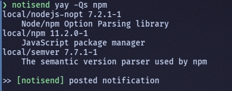
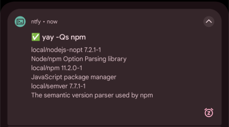

# notisend


A wrapper to send command outputs as a notification to ntfy





# Documentation and usage

To receive notifications, first you need to download [ntfy](https://ntfy.sh/) and subscribe to a topic of your choosing.

## Options

`-h`, `--help`: Show the help message.

`-v`, `--version`: Show the version information.

`-s`, `--show-config`: Show the current configuration.

`--create-config`: Force creation of a new configuration file.

`-p`, `--priority <1-5>`: Set the notification priority.

`-e`, `--emojis <tag>`: Set the notification tags (emojis).

`-t`, `--topic`: Set the notification topic.

`-o`, `--host`: Set the host.

## Configuration

Configuration is stored in `$HOME/.config/notisend.conf`

If the file does not exist, it will be created interactively when running a command, or you can use `--create-config`.

Check the [example config](example_config.conf) for details.

> Check ntfy documentation for [tags](https://docs.ntfy.sh/emojis/) and [priorities](https://docs.ntfy.sh/publish/#message-priority)


## Examples

`notisend sleep 5`

`notisend -p 4 -t "computer" yay -Syu`

`notisend -c`

`notisend --create-config`

# Installation

### Using cURL

```sh

chmod +x ~/.local/bin/notisend
```

### Using wget

```sh

chmod +x ~/.local/bin/notisend
```

### Specific version

- Download the versioned release from GitHub releases
- Extract the script
- Move to `~/.local/bin`, `/usr/local/bin` or `/usr/bin`
- Make the file executable with `chmod +x notisend`
